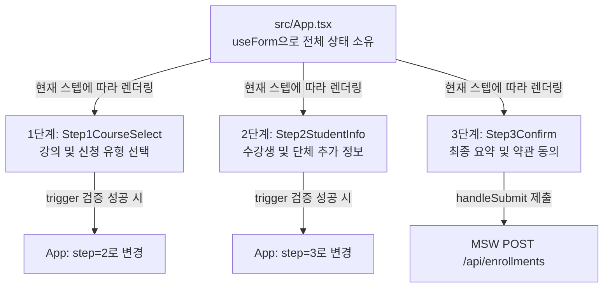

# 📘 주니어 개발자를 위한 코드 해설집 - [04] 다단계 폼 UI 컴포넌트와 상태 관리

이 문서에서는 3단계로 나뉜 **"다단계 수강 신청 폼"**의 프론트엔드 UI 컴포넌트들이 어떻게 유기적으로 동작하고 상태를 공유하는지 실제 소스 코드를 라인별로 정밀 분석하여 주니어 개발자의 눈높이에 맞춰 쉽게 해설합니다.

---

## 1. 다단계 폼(Multi-step Form)의 전체 구조 흐름

여러 단계로 나뉜 폼을 개발할 때 흔히 저지르는 실수는 **"각 단계로 넘어갈 때마다 이전 입력 데이터가 날아가거나, 컴포넌트별로 상태가 파편화되어 마지막 제출 시 합치기 어려운 문제"**입니다.

우리는 이 문제를 해결하기 위해 **가장 최상위 부모인 `src/App.tsx`에서 모든 폼의 상태를 중앙 집중식으로 관리**하는 방식을 채택했습니다.

### 🧩 폼 데이터의 중앙 집권화 흐름도



### 📄 부모 컴포넌트의 폼 공급소: `FormProvider` 구조

```tsx
// src/App.tsx (라인 209 ~ 216 참고)
<FormProvider {...methods}>
  <form onSubmit={handleSubmit(onSubmit)} noValidate>
    
    <div style={{ minHeight: '320px', marginBottom: '32px' }}>
      {step === 1 && <Step1CourseSelect />}
      {step === 2 && <Step2StudentInfo />}
      {step === 3 && <Step3Confirm setStep={setStep} />}
    </div>
    
    ...
  </form>
</FormProvider>
```

* **`<FormProvider>`**: React Hook Form이 제공하는 Context Provider입니다. 부모의 `methods` 객체(유효성 검사, 필드 등록 상태 등)를 하위 컴포넌트들에게 전역 context 형태로 전달합니다.
* **`{step === 1 && ...}`**: 스텝 상태에 따라 해당하는 화면만 교체해 렌더링합니다. 이때 DOM에서는 사라지지만 `<FormProvider>` 아래에서 폼 데이터 상태는 고스란히 보존됩니다.

---

## 2. 각 컴포넌트별 핵심 소스 코드 분석

### ① [src/App.tsx] - 폼의 오케스트라 지휘자

이 파일은 현재 몇 단계인지(`step` 상태)를 관리하고, 전체 폼의 유효성 검사 및 최종 API 전송을 지휘합니다.

#### 1) `useForm` 초기 선언 및 리졸버 연동

```typescript
// src/App.tsx (라인 36 ~ 49)
const methods = useForm<EnrollmentFormData>({
  resolver: zodResolver(enrollmentFormSchema),
  mode: 'onChange',
  defaultValues: {
    courseId: '',
    enrollmentType: 'personal',
    name: '',
    email: '',
    phone: '',
    motivation: '',
    agreedToTerms: false
  }
});
```

* **`resolver: zodResolver(enrollmentFormSchema)`**: Zod 스키마를 React Hook Form의 유효성 검증 엔진으로 연결합니다.
* **`mode: 'onChange'`**: 사용자가 타이핑하거나 선택할 때마다 실시간으로 유효성을 검증하여 에러 상태를 즉각 업데이트합니다.
* **`defaultValues`**: 폼 최초 진입 시 빈 값이나 기본 라디오 상태('personal')를 선언하여 undefined 참조 에러를 예방합니다.

#### 2) 단계별 부분 유효성 검증 (`handleNextStep`)

```typescript
// src/App.tsx (라인 54 ~ 85)
const handleNextStep = async () => {
  if (step === 1) {
    // 1단계: 강좌와 신청 유형 필수 선택 체크
    const isValid = await trigger(['courseId', 'enrollmentType']);
    if (isValid) setStep(2);
  } else if (step === 2) {
    // 2단계: 공통 인적 사항 검사 대상 설정
    const fieldsToValidate: any[] = ['name', 'email', 'phone', 'motivation'];

    // 단체 신청일 경우에는 단체 추가 필드들 및 동적 참가자 명단까지 전부 검사
    const type = getValues('enrollmentType');
    if (type === 'group') {
      fieldsToValidate.push(
        'group.organizationName',
        'group.contactPerson',
        'group.contactPhone',
        'group.headCount'
      );

      const participants = getValues('group.participants') || [];
      participants.forEach((_, idx) => {
        fieldsToValidate.push(
          `group.participants.${idx}.name`,
          `group.participants.${idx}.email`
        );
      });
    }

    const isValid = await trigger(fieldsToValidate);
    if (isValid) setStep(3);
  }
};
```

* **`trigger(fields)`**: 인자로 전달받은 필드 리스트만 골라서 유효성 검증을 호출하는 비동기 함수입니다.
* **`step === 1`**: 1단계에서 다음으로 넘어갈 때 `courseId`와 `enrollmentType`만 검사합니다. 아직 입력되지 않은 2단계, 3단계의 필수값들은 무시하여 부드럽게 스텝을 전환합니다.
* **`step === 2 (단체 조건부)`**: `enrollmentType`이 `'group'`일 경우 `fieldsToValidate` 배열에 단체 정보(`group.organizationName` 등) 및 참가자 명단의 각 인덱스에 매칭되는 필드 경로(`group.participants.0.name` 등)를 dynamic하게 밀어넣어 일괄 검증을 진행합니다.

#### 3) 최종 3단계 확인 후 폼 제출 및 가공 (`onSubmit`)

```typescript
// src/App.tsx (라인 90 ~ 135)
const onSubmit = async (data: EnrollmentFormData) => {
  setIsSubmitting(true);
  setSubmitError(null);

  // API 스펙(handlers.ts)에 맞춰 데이터 형태 가공 (applicant 오브젝트 구조 맵핑)
  const apiPayload = {
    courseId: data.courseId,
    type: data.enrollmentType,
    applicant: {
      name: data.name,
      email: data.email,
      phone: data.phone
    },
    motivation: data.motivation,
    agreedToTerms: data.agreedToTerms,
    group: data.enrollmentType === 'group' ? {
      organizationName: data.group?.organizationName,
      contactPerson: data.group?.contactPerson,
      contactPhone: data.group?.contactPhone,
      headCount: Number(data.group?.headCount) || 2,
      participants: data.group?.participants
    } : undefined
  };

  try {
    const response = await fetch('/api/enrollments', {
      method: 'POST',
      headers: { 'Content-Type': 'application/json' },
      body: JSON.stringify(apiPayload)
    });

    const resultData = await response.json();

    if (!response.ok) {
      // 서버에서 전달한 API 에러 메시지가 있을 시 이를 예외 처리로 던짐
      throw new Error(resultData.message || '수강 신청 제출에 실패했습니다.');
    }

    // 신청 성공 상태 기록
    setSubmitResult(resultData);
  } catch (err: any) {
    setSubmitError(err.message || '네트워크 오류가 발생했습니다. 잠시 후 다시 시도해 주세요.');
  } finally {
    setIsSubmitting(false);
  }
};
```

* **`apiPayload` 매핑**: React Hook Form이 가지고 있는 평탄화(Flat)된 데이터 구조를 MSW 가짜 백엔드 API 명세(`applicant` 오브젝트와 `group` 오브젝트 분리 구조)에 맞게 객체 변환합니다. 단체 신청이 아닐 경우 `group`을 `undefined` 처리하여 전송 데이터를 깔끔하게 유지합니다.
* **`!response.ok` 에러 처리**: HTTP 상태 코드가 200번대가 아닐 경우(400, 409 등) 서버가 제공한 에러 메시지(예: "이미 수강 신청이 완료된 강의입니다.")를 추출하여 `submitError` 상태에 바인딩하고, 화면 상단에 경고박스를 노출합니다.

---

### ② [src/components/steps/Step1CourseSelect.tsx] - 1단계: 강의 및 유형 선택

이 파일은 TanStack Query를 이용해 강의 목록을 불러오고, 카테고리별 필터링과 신청 유형(개인/단체)에 따른 데이터 청소를 수행합니다.

#### 1) Context 바인딩 및 폼 실시간 모니터링

```typescript
// src/components/steps/Step1CourseSelect.tsx (라인 20 ~ 30)
const {
  register,
  watch,
  setValue,
  formState: { errors }
} = useFormContext<EnrollmentFormData>();

const selectedCourseId = watch('courseId');
const enrollmentType = watch('enrollmentType');
```

* **`useFormContext`**: 상위 `<FormProvider>`로부터 전달받은 폼 인스턴스에 접근합니다.
* **`watch()`**: 해당 필드들의 변화를 구독하여 컴포넌트가 새로운 값에 따라 반응적으로 리렌더링하게 만듭니다.

#### 2) 카테고리 탭 연동과 React Query 비동기 페칭

```typescript
// src/components/steps/Step1CourseSelect.tsx (라인 32 ~ 49)
const [activeCategory, setActiveCategory] = useState<string>('all');

const { data, isLoading, isError } = useQuery<CourseListResponse>({
  queryKey: ['courses', activeCategory],
  queryFn: async () => {
    const url = activeCategory === 'all' 
      ? '/api/courses' 
      : `/api/courses?category=${activeCategory}`;
    const response = await fetch(url);
    if (!response.ok) {
      throw new Error('강좌 정보를 불러오는 중 에러가 발생했습니다.');
    }
    return response.json();
  }
});
```

* **`queryKey: ['courses', activeCategory]`**: `activeCategory`가 변할 때마다 캐시를 확인하고 필요시 자동으로 API 요청(`queryFn`)을 다시 보내 목록을 동기화합니다.

#### 3) 정원 마감 강의의 선택 제한 및 시각적 예외 처리

```typescript
// src/components/steps/Step1CourseSelect.tsx (라인 113 ~ 128)
{data.courses.map((course: Course) => {
  const isFull = course.currentEnrollment >= course.maxCapacity;
  const isSelected = selectedCourseId === course.id;

  return (
    <div
      key={course.id}
      className={`${styles.courseCard} ${
        isSelected ? styles.courseCardSelected : ''
      } ${isFull ? styles.courseCardFull : ''}`}
      onClick={() => {
        // 정원이 꽉 차지 않은 경우에만 선택을 허용
        if (!isFull) {
          setValue('courseId', course.id, { shouldValidate: true });
        }
      }}
    >
  ...
```

* **`isFull` 판별**: 현재 수강 신청 인원(`course.currentEnrollment`)이 정원(`course.maxCapacity`) 이상인지 체크합니다.
* **선택 차단**: 카드 클릭 핸들러에서 `!isFull`인 경우에만 `setValue('courseId', course.id)`를 실행해 정원이 꽉 찬 강좌는 절대 폼에 바인딩되지 못하도록 차단합니다. `{ shouldValidate: true }` 옵션은 값을 셋팅한 후 Zod 검증을 즉각 구동시킵니다.

#### 4) 신청 유형 전환 시 잔여 쓰레기 값 청소

```typescript
// src/components/steps/Step1CourseSelect.tsx (라인 213 ~ 254)
<input
  type="radio"
  value="personal"
  {...register('enrollmentType')}
  onChange={() => {
    setValue('enrollmentType', 'personal');
    setValue('group', undefined); // 개인으로 선택 시 단체 정보 필드 초기화
  }}
/>
...
<input
  type="radio"
  value="group"
  {...register('enrollmentType')}
  onChange={() => {
    setValue('enrollmentType', 'group');
    // 단체 선택 시 초기값 세팅 (기본 인원 2명)
    setValue('group', {
      organizationName: '',
      contactPerson: '',
      contactPhone: '',
      headCount: 2,
      participants: [
        { name: '', email: '' },
        { name: '', email: '' }
      ]
    });
  }}
/>
```

* **`setValue('group', undefined)`**: 개인 신청으로 라디오 버튼을 전환할 시, 이전에 입력했던 단체 정보(`group`) 잔여 데이터를 명시적으로 초기화합니다. 이렇게 함으로써 Zod 스키마 검증 시 불필요한 단체 필드 에러가 터지지 않게 안전망을 칩니다.
* **단체 정보 기본 구조 초기화**: 단체 신청 선택 시 `group` 객체 안에 기본 인원수(2명)와 2개의 빈 참가자 요소를 미리 배치하여, `useFieldArray`가 부드럽게 초기 인풋 박스를 그리도록 돕습니다.

---

### ③ [src/components/steps/Step2StudentInfo.tsx] - 2단계: 수강생 정보 입력

이 파일은 신청 유형에 따라 단체 추가 폼을 드러내며, 입력된 인원수에 맞추어 동적으로 참가자 리스트의 인풋 엘리먼트를 증감시키는 마법을 수행합니다.

#### 1) `useFieldArray`를 활용한 동적 배열 바인딩

```typescript
// src/components/steps/Step2StudentInfo.tsx (라인 28 ~ 36)
const enrollmentType = watch('enrollmentType');
const headCount = watch('group.headCount');

const { fields, append, remove } = useFieldArray({
  control,
  name: 'group.participants'
});
```

* **`useFieldArray`**: 객체 내부의 리스트 형태(예: `group.participants`)를 동적으로 다루기 위해 사용하는 훅입니다.
* **`fields`**: `id` 속성을 지닌 배열 요소를 제공하여 리액트가 렌더링 시 고유한 `key`를 갖도록 보장합니다.

#### 2) `useEffect`와 인원수 입력 연동을 통한 참가자 칸 실시간 증감

```typescript
// src/components/steps/Step2StudentInfo.tsx (라인 38 ~ 59)
useEffect(() => {
  if (enrollmentType === 'group') {
    const count = Number(headCount) || 0;
    const currentLength = fields.length;

    // 2~10명 사이인 경우에만 동기화 처리 진행
    if (count >= 2 && count <= 10) {
      if (count > currentLength) {
        // 인원이 늘어났을 시 빈 참가자 객체 추가
        for (let i = currentLength; i < count; i++) {
          append({ name: '', email: '' });
        }
      } else if (count < currentLength) {
        // 인원이 줄어들었을 시 마지막부터 참가자 필드 제거
        for (let i = currentLength - 1; i >= count; i--) {
          remove(i);
        }
      }
    }
  }
}, [headCount, enrollmentType, append, remove, fields.length]);
```

* **인원수 감시**: `headCount`가 바뀔 때마다 훅 내부의 `useEffect`가 실행됩니다.
* **`count > currentLength`**: 사용자가 인원수를 늘리면 모자란 개수만큼 `append({ name: '', email: '' })`를 연속 실행하여 인풋 창을 동적으로 늘려줍니다.
* **`count < currentLength`**: 사용자가 인원수를 줄이면 넘치는 개수만큼 배열 뒷부분부터 `remove(i)`를 실행하여 폼 구조를 깎아냅니다.
* **2~10명 제한 가드**: 범위를 벗어난 경우에는 동작을 제어함으로써 Zod의 엄격한 인원수 범위 스키마와 뷰 레이어의 정합성을 일치시킵니다.

#### 3) 동적 배열 input 필드 렌더링 및 개별 유효성 에러 바인딩

```tsx
// src/components/steps/Step2StudentInfo.tsx (라인 274 ~ 306)
{fields.map((field, index) => (
  <motion.div key={field.id} className={styles.participantRow}>
    <span className={styles.rowNum}>{index + 1}</span>

    {/* 이름 입력 */}
    <div className={styles.rowField}>
      <input
        type="text"
        className={`${styles.input} ${styles.rowInput} ${
          errors.group?.participants?.[index]?.name ? styles.inputError : ''
        }`}
        placeholder="이름"
        {...register(`group.participants.${index}.name` as const)}
      />
      {errors.group?.participants?.[index]?.name && (
        <span className={styles.rowError}>
          {errors.group.participants[index]?.name?.message}
        </span>
      )}
    </div>

    {/* 이메일 입력 */}
    <div className={styles.rowField}>
      <input
        type="email"
        className={`${styles.input} ${styles.rowInput} ${
          errors.group?.participants?.[index]?.email ? styles.inputError : ''
        }`}
        placeholder="이메일 주소"
        {...register(`group.participants.${index}.email` as const)}
      />
      {errors.group?.participants?.[index]?.email && (
        <span className={styles.rowError}>
          {errors.group.participants[index]?.email?.message}
        </span>
      )}
    </div>
  </motion.div>
))}
```

* **`key={field.id}`**: React Hook Form 동적 필드는 인덱스 대신 반드시 `field.id`를 키값으로 사용해야 정렬이나 삭제 시 포커스가 꼬이는 현상을 막을 수 있습니다.
* **`errors.group?.participants?.[index]?.name`**: 동적 리스트 내 각 줄의 이름/이메일 입력 여부 오류를 정확히 추적하여 인라인 경고 메시지를 노출합니다.
* **`register('group.participants.${index}.name' as const)`**: 인덱스별 경로 문자열을 템플릿 리터럴로 정확하게 꽂아주어 각 행의 데이터를 고유하게 캡처합니다.

---

### ④ [src/components/steps/Step3Confirm.tsx] - 3단계: 확인 및 제출

이 파일은 최종 검토 화면을 렌더링하며, 사용자가 내용을 쉽게 고치고 되돌아올 수 있게 수정 지시 콜백을 처리합니다.

#### 1) `watch()`를 통한 전체 입력 데이터 요약 렌더링

```typescript
// src/components/steps/Step3Confirm.tsx (라인 25 ~ 33)
const {
  register,
  watch,
  formState: { errors }
} = useFormContext<EnrollmentFormData>();

const formData = watch();
const { courseId, enrollmentType, name, email, phone, motivation, agreedToTerms, group } = formData;
```

* **`watch()` (인자 없음)**: 폼의 전체 상태를 담은 커다란 오브젝트를 반환합니다. 이를 비구조화 할당하여 요약 테이블(Summary Screen)에 즉각 매핑하여 렌더링합니다.

#### 2) 스텝 바로가기 콜백 활용

```tsx
// src/components/steps/Step3Confirm.tsx (라인 111 ~ 122)
<div className={styles.cardHeader}>
  <h3>신청자 인적 사항</h3>
  <button 
    type="button" 
    className={styles.editBtn} 
    onClick={() => setStep(2)} // 2단계로 즉각 되돌려 보내기
  >
    <Edit2 size={13} />
    <span>수정</span>
  </button>
</div>
```

* **스텝 바로가기 (`setStep(n)`)**: 3단계 요약 항목들을 검토하다가 `[수정]`을 누르면 부모가 공유한 `step` 상태를 직접 1단계 또는 2단계로 변경시킵니다.
* **데이터 유지 보장**: 단순히 UI만 이전 단계로 전환될 뿐, 이미 리액트 훅 폼 context 메모리에 완벽히 저장된 입력 필드값들은 전혀 유실되지 않고 사용자를 맞이합니다.

---

## 3. 최종 제출(Submit)과 리셋(Reset) 마법

수강 신청 프로세스의 양 끝단인 **"최종 제출 시 로딩 처리"**와 **"초기화 후 처음으로 복귀"**의 원리를 분석해 보겠습니다.

### ① 제출 중 중복 전송 방지 및 로딩 상태

```tsx
// src/App.tsx (라인 253 ~ 275)
<button
  type="submit"
  className="btn btn-primary"
  disabled={isSubmitting}
>
  {isSubmitting ? (
    <>
      <RefreshCw size={16} className="spin-icon" />
      <span>신청서 전송 중...</span>
    </>
  ) : (
    <span>신청서 제출</span>
  )}
</button>
```

* **`isSubmitting` 비활성화**: API 호출이 펜딩되는 1.5초 동안 `disabled={isSubmitting}` 옵션을 통하여 제출 버튼과 이전 단계 버튼을 전부 얼려버립니다. 이를 통해 찰나의 네트워크 지연 시간 동안 성급한 사용자가 제출 버튼을 여러 번 연타하는 **중복 API 호출(Double Submit) 현상을 기술적으로 원천 방지**합니다.

### ② 완전 초기화 및 1단계 복귀

```typescript
// src/App.tsx (라인 138 ~ 151)
const handleRestart = () => {
  reset({
    courseId: '',
    enrollmentType: 'personal',
    name: '',
    email: '',
    phone: '',
    motivation: '',
    agreedToTerms: false
  });
  setSubmitResult(null);
  setSubmitError(null);
  setStep(1);
};
```

* **`reset(defaultValues)`**: 단순히 리액트 컴포넌트 상태만 비우는 것이 아니라, React Hook Form의 내부 레지스트리에 등록된 모든 필드의 입력값, 터치 여부(`isTouched`), 에러 상태, 더티 플래그(`isDirty`)를 깨끗하게 청소해 줍니다.
* 리셋이 완료되면 API 응답 상태를 나타내던 `submitResult`를 비우고 최초 1단계 화면으로 리다이렉트하여, 깨끗해진 새 폼 양식으로 새로운 신청을 받을 준비를 마칩니다.

---

## 4. 🛠️ 빌드 무결성(Build Integrity)이란 무엇인가요?

실무에서 협업을 하거나 배포를 진행할 때 **"빌드 무결성(Build Integrity)을 확인했나요?"**라는 질문을 자주 받게 됩니다.

### ① 쉽게 이해하는 개념 (조립식 가구 비유)

우리가 코드를 짜는 것은 완제품을 만드는 것이 아니라, 이케아(IKEA) 조립식 가구의 **"개별 부품"**을 설계하는 과정과 같습니다.

* **코딩 단계**: 나무판자, 나사못, 손잡이 등을 깎고 설계하는 단계.
* **빌드(Build) 단계**: 설계도를 보며 부품들을 하나로 조립하여 실제 쓸 수 있는 가구로 완성하는 단계.

이때 **빌드 무결성이 유지된다**는 것은, 부품들을 설명서대로 전부 결합해 완성품을 만들었을 때 **"나사가 헛돌거나, 구멍이 맞지 않거나, 부품이 모자라서 흔들거리는 하자가 전혀 없이 완벽하게 단단한 완제품이 조립된 상태"**를 의미합니다.

### ② 개발 시점(런타임)과 배포 시점(컴파일)의 차이

코드를 작성하고 로컬 서버를 띄워 개발할 때는 브라우저가 다소 너그럽게 오류를 넘어가 주기도 하고, 특정 컴포넌트 화면을 열기 전까지는 숨어 있는 에러가 나타나지 않을 수 있습니다.
그러나 **빌드(Build)**를 실행하면 컴퓨터가 소스 코드 전체를 엄격한 잣대로 한꺼번에 스캔하여 파일로 구워냅니다. 이때 오류가 하나도 없어야만 배포용 파일이 온전하게 추출됩니다.

### ③ 빌드 무결성이 중요한 이유

1. **화면 먹통 방지 (No White Screen)**: 브라우저가 첫 로딩 시점에 코드가 깨져 화면을 전혀 그리지 못하고 새하얗게 멈추는 치명적인 런타임 에러를 100% 예방합니다.
2. **참조 정합성 확보**: 존재하지 않는 경로에서 컴포넌트를 import하려는 실수(깨진 참조)를 배포 전에 확실하게 차단합니다.
3. **타입 안전성 입증**: 데이터의 규격이 어긋난 상태(예: 숫자 값 자리에 문자열이 들어가는 코드)로 서비스가 나가는 것을 컴파일러가 몸으로 막아줍니다.

---

## 💡 주니어 실무 팁: Strict 빌드 옵션과 `import type`

프로젝트 설정 중 `tsconfig.json` 파일의 `"verbatimModuleSyntax": true`와 같이 엄격한 모듈 옵션이 켜져 있는 경우, 개발할 때는 멀쩡했던 코드가 `npm run build` 단계에서 갑자기 아래와 같은 빌드 에러를 내며 실패할 수 있습니다.

```bash
error TS1484: 'EnrollmentFormData' is a type and must be imported using a type-only import when 'verbatimModuleSyntax' is enabled.
```

### 왜 발생하나요?

이 옵션은 컴파일러에게 **"타입 전용 코드는 자바스크립트로 변환할 때 찌꺼기가 남지 않게 확실히 구분해서 지워줘!"**라고 지시하는 설정입니다.
단순히 `import { EnrollmentFormData }`로 쓰면, 이것이 런타임에 실행되는 실체(값)인지 아니면 타입(가상 도안)인지 컴파일러가 빌드 시점에 헷갈려합니다.

### 어떻게 해결하나요?

타입으로만 사용되는 데이터를 불러올 때는 **`import type`** 키워드를 명확하게 선언해 줌으로써 빌드 무결성을 완벽하게 지켜줄 수 있습니다.

```typescript
// AS-IS (빌드 에러 유발 가능)
import { EnrollmentFormData } from '../types/form';

// TO-BE (명시적 타입 임포트 - 빌드 무결성 확보!)
import type { EnrollmentFormData } from '../types/form';
```

이와 같이 빌드 시점의 컴파일러 경고를 경청하고 규격을 정교하게 맞춰주는 습관이 탄탄한 빌드 무결성을 만드는 첫걸음입니다.
