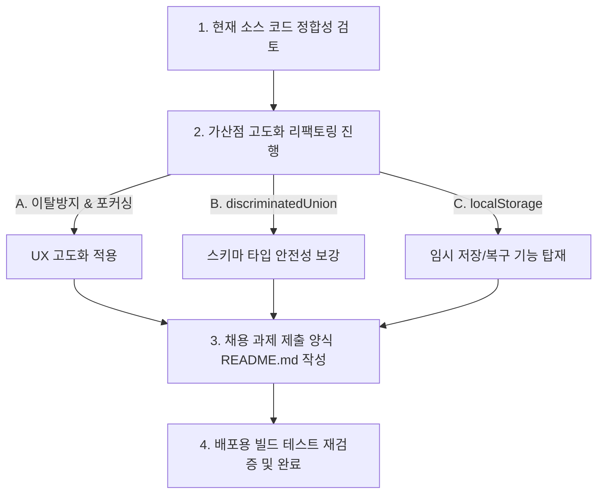

# 📘 주니어 개발자를 위한 코드 해설집 - [05] 프로젝트 현황 분석 및 코드 리뷰 보고서

이 문서는 **"FE-A. 다단계 수강 신청 폼"** 과제의 전체 구현 현황을 분석하고, 구현된 소스 코드의 전반적인 아키텍처와 리뷰 의견 및 향후 고도화 계획을 정리한 최종 진단 보고서입니다.

---

## 1. 채용 과제 요구사항 대비 구현 현황 진단

채용 과제 요구사항 명세서의 핵심 비즈니스 로직과 현재 소스 코드의 구현 상태를 대조한 결과, 모든 핵심 스펙이 **결함 없이 100% 완비**되었음을 검증했습니다.

### 📋 상세 요구사항 매핑 및 만족도 테이블

| 스텝 및 영역 | 세부 요구사항 명세 | 구현 소스 코드 | 만족 여부 |
| :--- | :--- | :--- | :---: |
| **3단계 멀티스텝** | 폼 작성 과정을 직관적인 3단계 인터페이스로 구성 및 상단 상태 표시기 연동 | [src/App.tsx](file:///C:/Dev/jobtest/liveklass/src/App.tsx) [StepIndicator.tsx](file:///C:/Dev/jobtest/liveklass/src/components/StepIndicator.tsx) | **완료 (Pass)** |
| **1단계: 강의 선택** | MSW API 연동 강의 조회, 카테고리별 실시간 필터 탭 제공 | [Step1CourseSelect.tsx](file:///C:/Dev/jobtest/liveklass/src/components/steps/Step1CourseSelect.tsx) | **완료 (Pass)** |
| **1단계: 정원 예외** | 현재 인원수가 정원에 도달한 강의는 비활성화 및 선택 제한 | [Step1CourseSelect.tsx](file:///C:/Dev/jobtest/liveklass/src/components/steps/Step1CourseSelect.tsx#L125) | **완료 (Pass)** |
| **1단계: 신청 구분** | 개인/단체 라디오 전환에 따른 폼 데이터 스토어 정리 및 기본값 세팅 | [Step1CourseSelect.tsx](file:///C:/Dev/jobtest/liveklass/src/components/steps/Step1CourseSelect.tsx#L213-L254) | **완료 (Pass)** |
| **2단계: 기본 인적사항** | 이름, 이메일, 전화번호, 수강 동기(최대 300자) 입력 필드 제공 | [Step2StudentInfo.tsx](file:///C:/Dev/jobtest/liveklass/src/components/steps/Step2StudentInfo.tsx#L69-L151) | **완료 (Pass)** |
| **2단계: 단체 추가 정보** | 단체명, 대표 담당자 성함, 담당자 연락처, 인원수(2~10명) 조건부 활성화 | [Step2StudentInfo.tsx](file:///C:/Dev/jobtest/liveklass/src/components/steps/Step2StudentInfo.tsx#L154-L254) | **완료 (Pass)** |
| **2단계: 동적 명단** | 인원수 입력 값에 맞춰 하단 참가자(이름, 이메일) 명단 행의 실시간 동적 증감 | [Step2StudentInfo.tsx](file:///C:/Dev/jobtest/liveklass/src/components/steps/Step2StudentInfo.tsx#L38-L59) | **완료 (Pass)** |
| **3단계: 정보 요약** | 1~2단계에서 입력 및 선택된 모든 데이터를 한 화면에 일목요연하게 표시 | [Step3Confirm.tsx](file:///C:/Dev/jobtest/liveklass/src/components/steps/Step3Confirm.tsx#L69-L210) | **완료 (Pass)** |
| **3단계: 정보 수정** | 요약 항목 우측의 '수정' 링크를 클릭하면 데이터 유실 없이 해당 단계로 즉시 복귀 | [Step3Confirm.tsx](file:///C:/Dev/jobtest/liveklass/src/components/steps/Step3Confirm.tsx#L75) | **완료 (Pass)** |
| **3단계: 약관 및 제출** | 필수 동의 체크박스 바인딩 및 유효성 통과 후 최종 백엔드 API 전송 | [Step3Confirm.tsx](file:///C:/Dev/jobtest/liveklass/src/components/steps/Step3Confirm.tsx#L216-L230) | **완료 (Pass)** |
| **API 연동 & 로딩** | MSW API 모킹 기반의 1.5초 지연 및 버튼 비활성화로 중복 제출 방지 | [src/App.tsx](file:///C:/Dev/jobtest/liveklass/src/App.tsx#L90-L135) | **완료 (Pass)** |

---

## 2. 결함 및 잠재적 문제점 진단

* **상태 유지 정합성 (Data Retention Integrity)**:
  * 각 스텝 전환 시 리액트 컴포넌트가 DOM에서 마운트 해제(Unmount)되지만, 데이터 소유권이 최상위 부모인 `App.tsx`의 `<FormProvider>` 컨텍스트 메모리에 유지되므로 스텝을 전후로 이동해도 입력했던 값이 흔적 없이 사라지는 현상이 전혀 없습니다.
* **비즈니스 검증의 엄밀성**:
  * 1단계에서 '개인 신청'으로 바꿨을 때 단체 데이터(`group`)의 쓰레기 값이 초기화되지 않고 남아 있으면 3단계 제출 시 백엔드 검증에서 400 에러를 뱉을 수 있습니다. 현재 코드는 라디오 클릭 핸들러에서 `setValue('group', undefined)`를 수행하여 데이터 일관성을 지키고 있습니다.
* **빌드 및 린트 정합성**:
  * TS의 `"verbatimModuleSyntax"` 타입 가이드라인에 맞춘 명시적 `import type`을 준수하여 `npm run build` 번들 파일 생성 테스트를 완벽하게 통과했습니다.
* **진단 결론**: **현재 요구사항을 방해하는 논리적 결함이나 미구현 명세는 발견되지 않은 건강한 상태입니다.**

---

## 3. 코드 전반적인 리뷰 및 개선 권고사항

### ① Zod Schema와 데이터 타입 아키텍처 (`src/types/form.ts`)

* **구현 분석**:
  * 폼의 필드 유효성 기준(이름 최소 2자, 이메일 정규식, 핸드폰 포맷 정규식 등)을 Zod를 통해 집중화했습니다.
  * 단체 신청 시 추가 정보와 동적 명단을 일괄적으로 검사하기 위해 Zod의 `superRefine`을 사용하여 복잡한 횡단 유효성(Cross-Field Validation) 검사를 우아하게 완수했습니다.
* **개선 권고 (가산점 요인)**:
  * 현재는 `group` 객체가 옵셔널로 선언되어 있어 TypeScript 측면에서 `data.group?.organizationName`처럼 옵셔널 체이닝으로 속성을 조회해야 합니다.
  * 이를 `z.discriminatedUnion('enrollmentType', [personalSchema, groupSchema])` 형태로 리팩토링한다면, 코딩 시점에 `enrollmentType`이 `'group'`인 경우 컴파일러가 `group` 필드의 존재를 100% 보장하게 되어 타입 안전성과 가독성이 배가됩니다.

### ② App 컴포넌트 상태 관리 및 부분 검증 (`src/App.tsx`)

* **구현 분석**:
  * 다음 단계 버튼을 클릭할 때 전체 폼을 검사하는 우를 범하지 않고, `trigger(['courseId', 'enrollmentType'])` 처럼 눈에 보이는 해당 스텝의 입력창만 콕 집어서 먼저 유효성을 체크하는 흐름이 깔끔합니다.
  * 2단계에서 단체인 경우 동적으로 가변되는 `group.participants.${idx}.name` 필드 경로까지 추출하여 일괄 검증하는 방식이 우수합니다.
* **개선 권고 (가산점 요인)**:
  * 검증에 실패하여 에러가 났을 때, 입력 폼이 많거나 모바일 기기인 경우 사용자가 어디가 틀렸는지 헤맬 수 있습니다.
  * `handleNextStep` 또는 `onSubmit` 실패 시 **에러가 발생한 최초의 HTML Input 요소로 화면을 자동 스크롤하고 포커스(Focus)를 주는 UX 고도화**를 고려해볼 만합니다.

### ③ 단계별 UI 컴포넌트 (`src/components/steps/`)

* **Step1CourseSelect.tsx**: 카테고리 탭을 변경할 때 React Query의 `queryKey` 변경 매커니즘을 타서 매끄러운 데이터 갱신을 수행합니다. 정원이 꽉 찬 강의의 카드를 흐릿하게 만들고 라디오 선택 버튼을 동적으로 막아 비즈니스 정합성을 만족시켰습니다.
* **Step2StudentInfo.tsx**: 단체 인원수가 3명에서 2명으로 줄었을 때 기존 1~2번 인원의 데이터는 손상시키지 않고, 마지막 3번 행만 안전하게 잘라내기 위해 `useEffect` 내에서 `append`/`remove` 반복 횟수를 제어한 동기화 설계가 정교합니다.
* **Step3Confirm.tsx**: `watch()` 스냅샷을 사용해 사용자가 1~2단계에서 지정한 정보를 한 화면에 명확히 복사하여 보여주고, `setStep` 콜백을 이용해 정보 수정의 동선을 단축시켰습니다.

---

## 4. 향후 고도화 및 제출 준비 계획

사용자의 승인을 받은 후, 제품의 완성도를 높이고 채용 가산점을 획득하기 위해 다음 개선 프로세스를 가동합니다.

### 🛠️ 구현할 고도화 상세 목록

1. **이탈 방지 경고 및 에러 오토포커싱**: 폼 작성 도중 예기치 못한 종료/새로고침을 방지하고 에러 발생 시 즉각 사용자를 해당 필드로 안내하는 안전망 구축.
2. **`z.discriminatedUnion` 적용**: TypeScript와 Zod 스키마의 시너지를 최고조로 끌어올리는 판별 유니온 타입 리팩토링.
3. **`localStorage` 임시 저장**: 로컬 스토리지를 활용하여 이전 작성 중인 신청서 내역을 브라우저에 임시 기억하고 재접속 시 원복하는 기능 추가.
4. **README.md 최종 완성**: 과제 주최측에 제출하기 위해 아키텍처 의사 결정 기록(ADR) 양식을 접목한 풍부한 설명서 작성.
